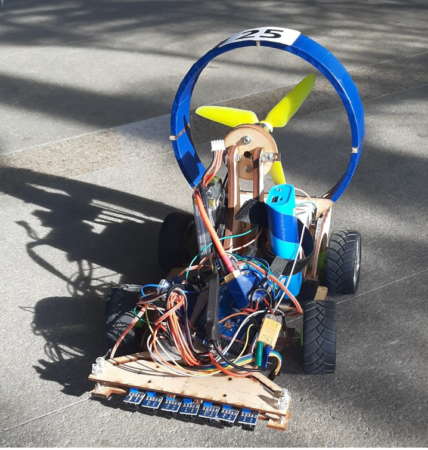

# Mechanical Engineering Capstone Project: Practice of Mechanical Engineering

## Course Project Overview
The Practice of Mechanical Engineering Course is the capstone course for the undergraduate program of Mechanial Engineering at National Taiwan University, 2020. The project consists of the design, manufacture, analysis, experiment and verification of a propeller-driven autonomous car with the ability of line tracking, speed control and overtaking another car. The design practices design for manufacturing with a limitation of budget, size and weight.

## The Final Car

